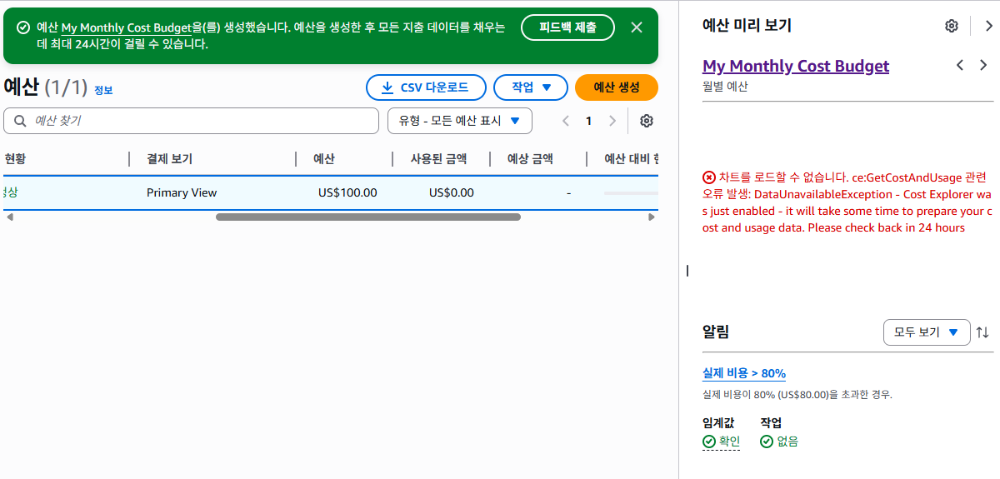
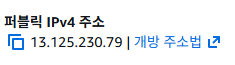
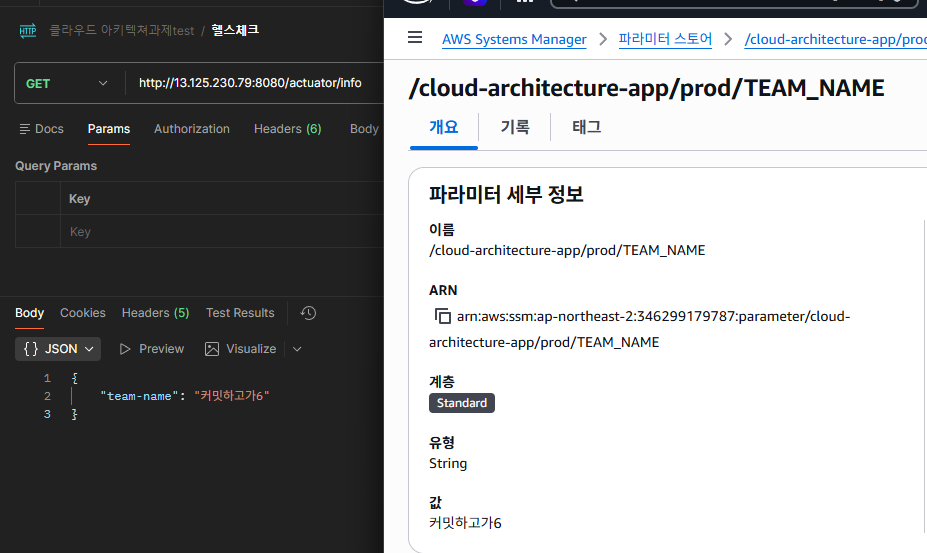
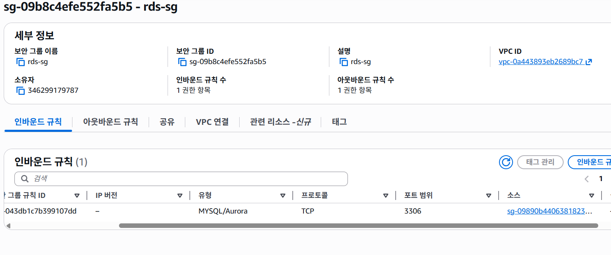
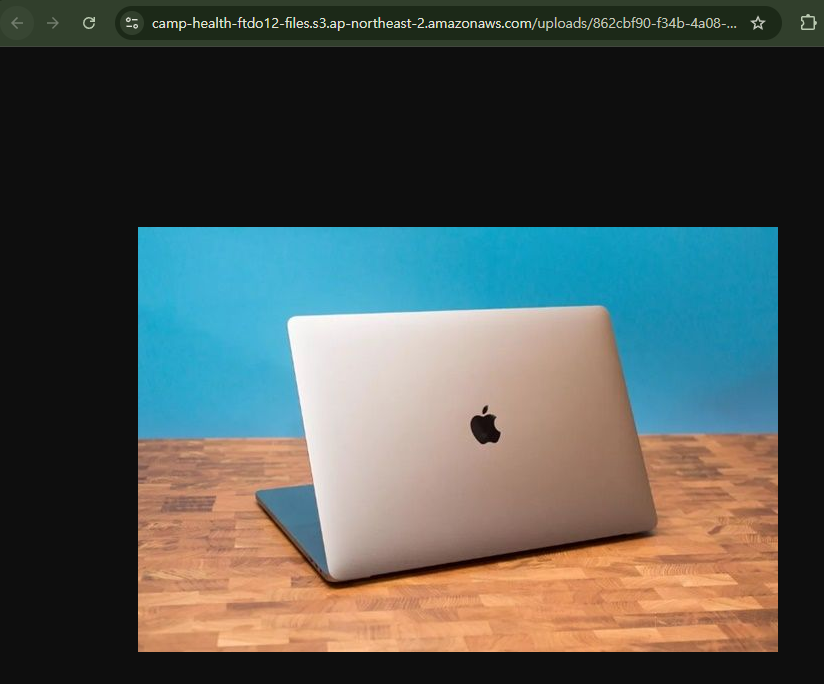
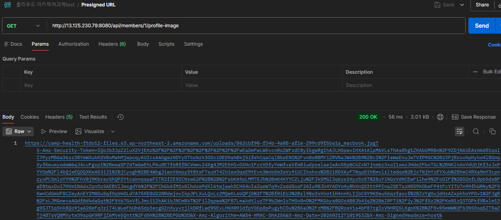

## ☁️ CH 4 클라우드_아키텍처 설계 & 배포(AWS활용)

## 📌 프로젝트 개요
서버 디스크에 저장하면 서버가 죽을 때 데이터도 함께 사라지는 문제를 해결하기 위해
AWS 클라우드 인프라(EC2, RDS, S3)를 활용한 운영 가능한 백엔드 서버를 구축했습니다.
로컬 환경과 운영 환경을 분리하고, 보안을 고려한 네트워크 설계 및 배포를 진행했습니다.

---

### 💰 LV 0 - 요금 폭탄 방지 AWS Budget 설정
> 클라우드 환경에서는 예상치 못한 과금이 발생할 수 있어 비용 모니터링이 필수입니다.

- 💵 월 예산 **$100** 설정
- 🔔 80% 도달 시 **이메일 알람** 설정으로 비용 사전 모니터링

---

### 🌐 LV 1 - 네트워크 구축 및 핵심 기능 배포
> 안전한 네트워크 환경을 만들고 운영 가능한 상태의 애플리케이션을 배포합니다.

- 🔒 VPC의 **Public/Private Subnet** 분리하여 안전한 네트워크 환경 구성
- 🖥️ Public Subnet에 EC2를 생성하여 외부 접근 가능한 서버 구축
- ⚙️ 로컬 환경(H2)과 운영 환경(MySQL)을 **Profile**로 분리하여 환경별 설정 관리
- 📊 **Actuator**를 통한 서버 상태 모니터링 엔드포인트 노출

#### 🖥️ EC2 퍼블릭 IP
- `13.125.230.79`

---

### 🗄️ LV 2 - DB 분리 및 보안 연결
> 서버 재시작 시 데이터가 초기화되는 문제를 해결하고 보안을 강화합니다.

- 💾 서버 재시작 시 데이터 초기화 문제를 해결하기 위해 **RDS(MySQL)** 로 DB 분리
- 🔐 EC2 보안그룹만 RDS 3306 포트에 접근 가능하도록 **보안그룹 체이닝** 적용
    - 직접 IP를 허용하지 않고 보안그룹 ID를 허용하여 보안 강화
- 🗝️ **AWS Parameter Store** 를 활용하여 DB 접속 정보(URL, ID, PW)를 코드에서 분리
    - Git에 민감한 정보가 노출되지 않도록 관리

#### 📡 Actuator Info 엔드포인트
- http://13.125.230.79:8080/actuator/info

#### 🔒 RDS 보안그룹 설정

---

### 🖼️ LV 3 - 프로필 사진 기능 추가 (S3)
> 서버 디스크 대신 S3에 이미지를 저장하여 서버가 죽어도 데이터를 보존합니다.

- 📦 서버 디스크 저장 시 재시작으로 이미지 소실 문제를 **S3** 로 해결
- 🔑 Access Key를 코드에 직접 넣지 않고 **IAM Role** 을 EC2에 연결하여 보안 강화
- 🚫 S3 버킷은 **퍼블릭 액세스 차단** 후 Presigned URL로만 이미지 접근 가능하도록 구현
    - ⏱️ **Presigned URL**: 일정 시간 동안만 유효한 임시 접근 URL (유효기간 7일)
    - 💡 DB에는 S3 **key값** 을 저장하고, 조회 시마다 새로운 Presigned URL 생성
    - ⚠️ Presigned URL 자체를 저장하지 않는 이유: 만료 후 URL이 무효화되기 때문

#### ⏰ Presigned URL 만료 시간
- `2026-03-19 19:19:53 KST`

#### ✅ 이미지 접근 성공 스크린샷

---

## 📋 API 명세서

### 👥 팀원 관리 API

| Method | URL | 설명 | 성공 응답 |
|--------|-----|------|---------|
| POST | /api/members | 팀원 정보 저장 | 200 |
| GET | /api/members/{id} | 특정 팀원 조회 | 200 |
| GET | /api/members | 전체 팀원 조회 | 200 |
| POST | /api/members/{id}/profile-image | 프로필 이미지 S3 업로드 | 200 |
| GET | /api/members/{id}/profile-image | Presigned URL 발급 (유효기간 7일) | 200 |

### ⚠️ 예외처리

| 상태코드 | 발생 상황 | 예외 클래스 |
|---------|---------|-----------|
| 400 Bad Request | name/mbti 공백, age 음수 입력 시 | MethodArgumentNotValidException |
| 404 Not Found | 존재하지 않는 ID 조회 시 | ResponseStatusException |
| 500 Internal Server Error | S3 업로드 실패 (IOException) 시 | FileUploadException |

### 📝 로그 전략

※추후 AOP적용하여 발전 필요성 존재

| 레벨 | 발생 시점 |
|------|---------|
| INFO | 모든 API 요청 시 `[API - LOG]` 로그 기록 |
| ERROR | 예외 발생 시 `[API - LOG]` + 스택트레이스 기록 |